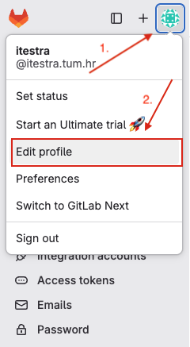
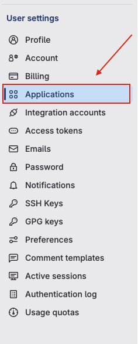
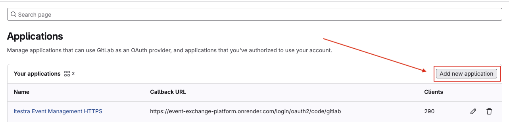
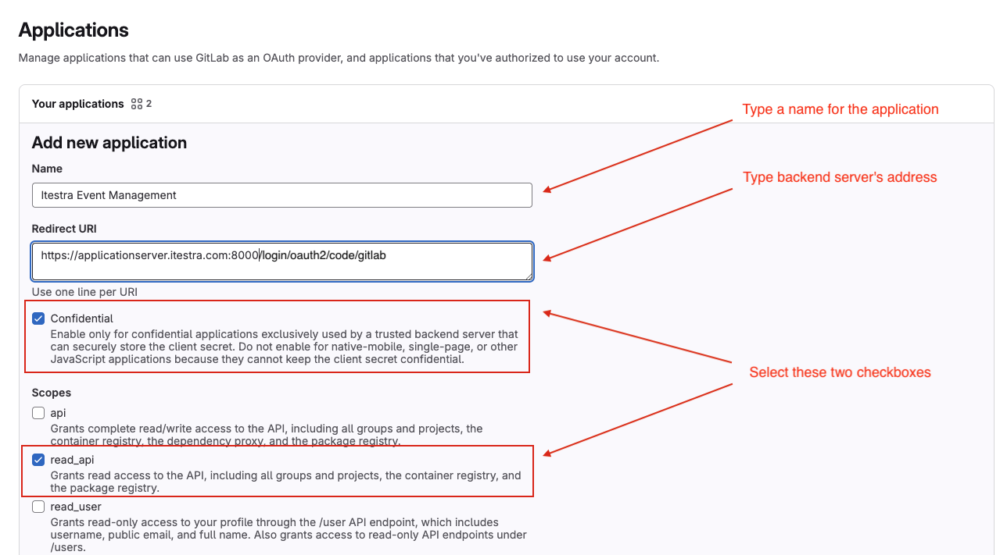
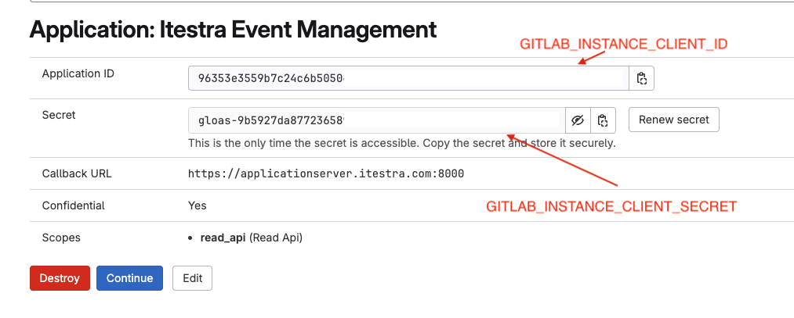

# 🎉 Itestra Event-Exchange-Platform

A smart web-based platform for planning and managing internal company events — built to enhance employee networking, streamline event organization, and automate intelligent seat allocation.

---

## 🚀 Overview

The **Event-Exchange-Platform** supports the organization of internal events at **itestra**, helping event managers:

- Plan events efficiently
- Manage employees and guests
- Design seating layouts visually
- Automatically allocate participants to seats using smart matching algorithms
- Avoid repeated pairings across events


---

## ✨ Key Features

- **Dashboard Overview**: Real-time summary of events, participation, and engagement.
- **Event Management**: Create/edit/delete events with support for detailed metadata.
- **Employee Directory**: Import, edit, and manage employees with filtering/export options.
- **Smart Matching Engine**: Apply constraints (e.g., location diversity, gender balance, avoid repeat pairs) to generate optimized seating plans.
- **Drag-and-Drop Seat Layout Designer**: Visually arrange tables and chairs.
- **Export Tools**: Export event data, seating plans, and participant lists as files for logistics or printing.
- **Past Match Memory**: Prevent repeat seatings across multiple events for improved networking.

---

## 🧠 Tech Stack

| Layer        | Technologies Used                             |
|-------------|------------------------------------------------|
| **Frontend** | React, Tailwind CSS, Ant Design, Vite         |
| **Backend**  | Java, Spring Boot, REST API, JPA (Hibernate)  |
| **Database** | PostgreSQL                                    |
| **DevOps**   | Docker, Docker Compose, GitHub Actions        |
| **Auth**     | GitLab OAuth                                  |
| **Testing**  | JUnit, Mockito, Vitest, React Testing Library |

---

## 🛠 Deployment

To run the platform locally or deploy on-premise:

```bash
  # Clone the repository
git clone https://github.com/DigitalProductInnovationAndDevelopment/Event-Exchange-Platform.git

# Navigate to project root
cd Event-Exchange-Platform

# Start all services using Docker Compose
docker compose -f docker-compose.yaml up --build
```

Ensure you have the appropriate `.env` file configured for environment-specific variables for production
You can take a look at the .env file in the GitHub repository.
```bash
  # Start all services using Docker Compose for production
docker compose -f docker-compose.prod.yaml up --build
```

---

## 📘 Usage Documentation

Full usage and feature instructions are available in the GitHub Wiki:

👉 **[Access the Usage Documentation](https://github.com/DigitalProductInnovationAndDevelopment/Event-Exchange-Platform/wiki/Usage-Documentation)**

You'll find step-by-step guides on:

- Creating and managing events
- Importing employees
- Designing seating layouts
- Allocating participants
- Exporting seating plans and data

> This documentation is intended for both event organizers and developers contributing to the platform.

---
## GitLab Authentication Setup

To use GitLab authentication with this application, you'll need to obtain a Client ID and Client Secret from GitLab. Follow these steps:

### Creating a GitLab OAuth Application

1. **Sign in to GitLab**
    - Navigate to [gitlab.com](https://gitlab.com) (or your GitLab instance)
    - Sign in with your GitLab account

2. **Access User Settings**
    - Click on your profile picture in the top-right corner
    - Select "Edit profile"
    - 

3. **Navigate to Applications**
    - In the left sidebar, click on "Applications"
    - Click the "New application" button
    - 
    - 
   
4. **Configure Your Application**
    - **Name**: Enter a descriptive name for your application (e.g., "My App Name")
    - **Redirect URI**: Enter your application's callback URL
      ```
      https://applicationserver.itestra.com:8000/login/oauth2/code/gitlab
      ```
      *Note: Replace with your actual domain and callback path in production*
    - **Scopes**: Select the required scopes for your application:
        - `read_user` - Read user information
    - **Confidential**: Leave this checked (recommended for server-side applications)
    - 
5. **Save the Application**
    - Click "Save application"

6. **Copy Your Credentials**
   After creating the application, you'll see:
    - **Application ID** (this is your `CLIENT_ID`)
    - **Secret** (this is your `CLIENT_SECRET`)

   ⚠️ **Important**: Copy these values immediately and store them securely. The secret will not be shown again.

   - 

## Environment Configuration

Add the obtained credentials to your environment variables:

```bash
# .env file
GITLAB_INSTANCE_CLIENT_ID=your_application_id_here
GITLAB_INSTANCE_CLIENT_SECRET=your_secret_here
```

## For GitLab Self-Managed Instances

If you're using a self-managed GitLab instance:

1. Replace `gitlab.com` with your GitLab instance URL
2. Follow the same steps above on your instance
3. Update your application configuration to point to your GitLab instance:

```bash
GITLAB_INSTANCE_ADDRESS=https://your-gitlab-instance.com
```

## Security Notes

- Keep your Client Secret confidential and never commit it to version control
- Use environment variables or secure secret management systems
- In production, ensure your redirect URI uses HTTPS
- Regularly rotate your credentials for enhanced security

---

## 📦 Repository Structure

```
Event-Exchange-Platform/
├── backend/                 # Spring Boot backend
├── frontend/                # React + Tailwind frontend
├── docker-compose.yml       # Service orchestration for development/test
├── docker-compose.prod.yml  # Service orchestration for production
├── .env                     # Sample environment config
└── README.md                # You're here!
```

---

## 👥 Contributors & Stakeholders

- **Event Managers** – Define event structures, goals, and constraints
- **HR/P&O** – Manage participants and configure constraints
- **Developers** – Maintain, improve, and extend the platform
- **System Admins** – Deploy and monitor the containerized app

---

## 📄 License

This project is internal to **itestra** and intended for use within the organization.

---

